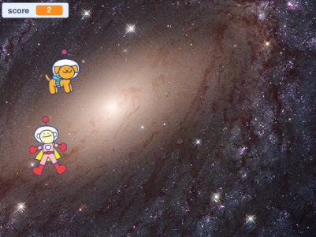

## Introduction

Create a Scratch game to simulate the effects of weightlessness in space. 

You will:

- Simulate weightlessness using a `forever`{:class="block3control"} loop and `point in direction`{:class="block3motion"} blocks.
- Add and edit a 'Game Over' backdrop then `switch backdrop`{:class="block3looks"} using code.
- Use the Scratch `timer`{:class="block3sensing"} variable and make your own `score variable`{:class="block3variables"} to create a game.

--- no-print ---
--- task ---
### Try it

  
Click on the green flag to start the game. Use the arrow keys to move around.

How many times can you catch the **Dot** dog sprite in 30 seconds?

  <iframe allowtransparency="true" width="485" height="402" src="https://scratch.mit.edu/projects/embed/501663888/?autostart=false" frameborder="0"></iframe>

--- /task ---
--- /no-print ---

--- print-only ---

--- /print-only ---

**Tim Peake** was the first British ESA astronaut to visit the International Space Station. You can find out more about his mission, the forces of gravity and the effects of weightlessness on [The National STEM Centre website](http://www.nationalstemcentre.org.uk/timpeake){:target="_blank"}.

