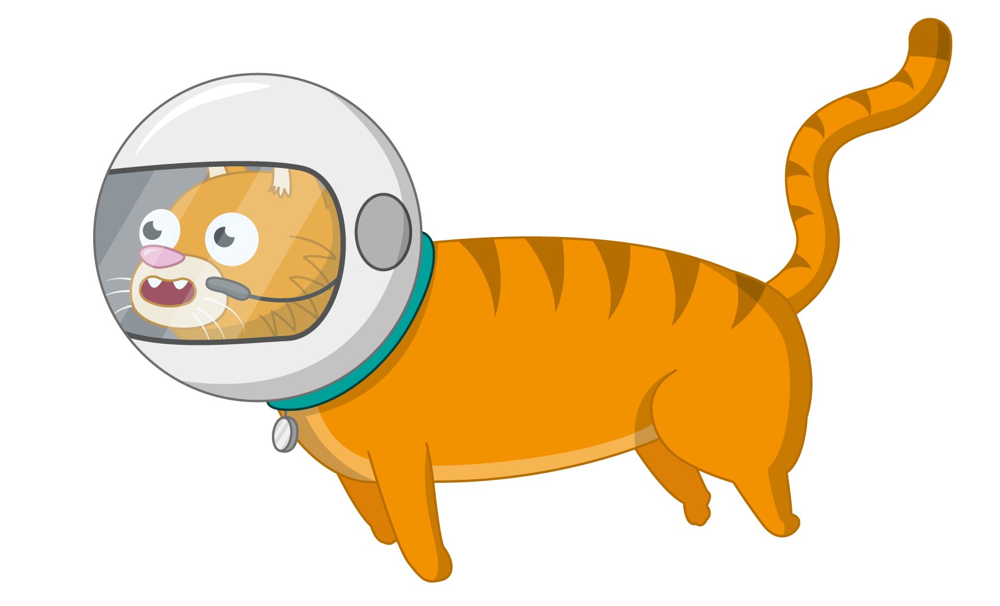

## Set the stage with a space theme

- If you are using a Raspberry Pi you can open Scratch by clicking on **Menu** and **Programming**, followed by **Scratch**.

- Create a new file by selecting **File** and **New**.

- Delete the Scratch cat sprite by right-clicking on it and selecting **Delete** from the menu that is displayed.

- For this project, you need to create a new background. To do this, click on `stage` in the sprites palette and then click on `Backgrounds` next to the `scripts` tab.

- Click on `Paint` to draw your own background. Once you're happy with your stage design, click **OK**. 	

- Next you will need to create a single sprite with two costumes, one shown flying and one falling. You can download an example sprite below which features Mooncake (the Raspberry Pi cat) wearing a jetpack.

     

-  If you are connected to the internet you can download this sprite by clicking on the image above or using this [link](images/Astro-Cat.sprite). Save the sprite somewhere you can find it later.

- Next, add a new sprite by clicking on the `import a new sprite` icon on the sprites palette (which looks like the image below), then select `Astro-Cat` from the choices and click **OK**.

	

- Click on the `costumes` tab for the Mooncake sprite. You will see two Mooncake costumes: one with a jetpack firing and one without. You will use these costumes within your game to show that Mooncake is moving.

- Click on the `scripts` tab of the sprite, and then save your Scratch project work by clicking on **File** and **Save As**. Name your program **weightless** and save it in your home directory or another place that you can find it later.

