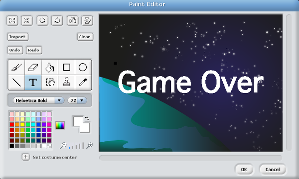
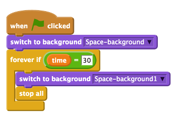

# Weightlessness Mooncake in Space

In space, it feels like everything is floating. This is because everything becomes **weightless** outside of our planet, Earth. This is probably the biggest difference from being on Earth, where everything, and everybody, is pulled down towards the ground. On Earth, we can all feel this downward pull, but we are so used to it that we sometimes do not even think about it. This pull or attraction we feel is called **gravity**.

You can recreate the effects of weightlessness in Space in this Scratch game.

## Set the stage with a space theme

1. If you are using a Raspberry Pi you can open Scratch by clicking on **Menu** and **Programming**, followed by **Scratch**. Alternatively you can use Scratch 2.0 online for this activity altho some of the blocks may be slightly different. 
1. Create a new file by selecting **File** and **New**.
1. Delete the Scratch cat sprite by right clicking on it and selecting **Delete** from the menu that is displayed.
1. For this project, you need to create a new background to act as the Earth. To do this, click on `stage` in the sprites palette and then click on `Backgrounds` next to the `scripts` tab.
1. Click on `Paint` to draw your own background. Select the rectangle icon and a green colour. It is important that you fill the rectangle with one solid colour. Once you are happy with your stage design click **OK**. 	
1. You can use the Scratch cat sprite or alterntively you can use our [Mooncake - the Astro Cat sprite](files/Astro-cat.png). If your Raspberry Pi is connected to the internet you can download this sprite using the link. Save the image somewhere that you will be able to find it later on your Raspberry Pi.
1. Next add a new sprite by clicking on the `import a new sprite` icon on the sprites palette (which looks like the image below) and select `Astro-cat.png` from the choices and click **Ok**.

	
	
1. Click on the `costumes` tab for the Mooncake sprite. You will see one costume listed. Click on **import**. This time select [Mooncake - the Astro Cat sprite version 2](files/Astro-cat2.png). You will see two Mooncake costumes - one with a backpack firing and one without flames. You will use these costumes within your game to show that Mooncake moving. 
	  	
1. Click on the `scripts` tab of the sprite and save your Scratch project work by clicking on **File** and **Save As**. Name your progam **weightless** and save it in your home directory or some place that you can find it later.

## Setting the start position

1. Open the `Control` blocks area and begin by dragging a `When green flag clicked` block into the main script area.

1. To make sure that Mooncake starts at the top of the screen at the start of the program you will need to set the coordinates. Use a `go to x: 0  y: 0` block from the `Motion` blocks area. Drag it over and clip it beneath `When green flag clicked`.

1. Drag a `point in direction` motion block and connect it to your script.

1. Click on the **Control** blocks and add a `broadcast` block. Select **New** from the drop-down menu. Name the new broadcast message `start`.

	

	A broadcast block with a unique message is used to coordinate the actions of different sprites and the stage in scratch.

## Adding movement

As Mooncake is in Space, she would be experiencing the effects of weightlessness and float about. We've given her a backpack so that she can change direction thanks to a force of energy. You see without a backpack or anything to push against, Mooncake would just keep going in one direction!

1. With the Astro-cat sprite selected, click on the control blocks and add a `when I receive` block to the stage. Select **start** from the drop down list. Remember this is the message that is broadcast by your first script.

1. Next add a `forever` looping block undrneath. 

1. Inside the forever loop add a `move 2 steps` block. 

1. Save your work so far and conn
	

## Creating a Game Over screen

First you need to add a new Game Over background to the stage. You could paint or import a new one, but here we will duplicate the existing space background and edit it to display Game Over across it in large letters. 

1. Click on the **stage** icon and then click on **backgrounds**. Make a copy of the space background by clicking on **copy**. 

1. Now click on **Edit** to open the paint editor window. Using the text tool type 'Game Over' in large letters on the background. You can choose a colour and font that you like. When you are happy with how it looks click on **OK**.

	

1. Next click on the **Scripts** tab and add a `when green flag clicked` control block to the scripts area. Note that the scripts area on the stage should be empty. All your other scripts are on your sprites.

1. Add a `switch to background` look block underneath. Select **space background** from the drop down box. This is the stage that you want the game to start with. 

1. Now add a `forever if` block to the script. Place an equals operator block inside the hexagon section of the forever if block. Click on the variables blocks and drag the `time` variable block and add it to the left hand side of `=`. Type `30` into the right hand side `=`.

1. Then inside the foerver if block, place a `switch to background` block. Select **space background1** from the drop down list. This should be your game over screen. 

1. Finally add a `stop all` control block underneath the last block. This will stop the game.

	


5. Add the control block broadcast and create a new broadcast message called Game Over.	